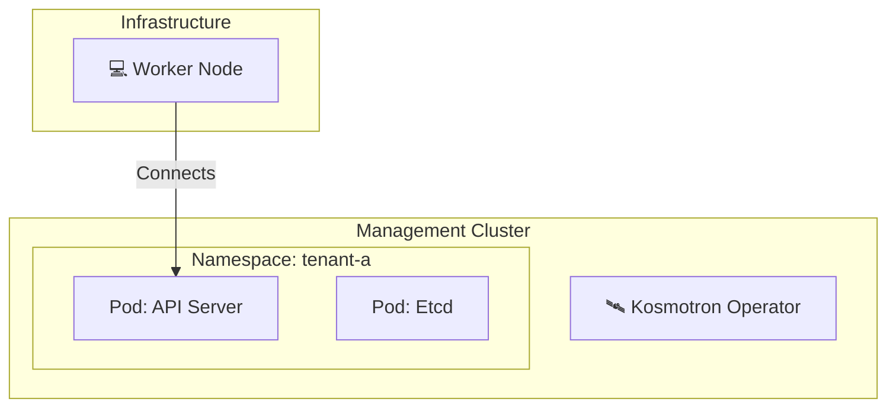

# Module 05: Kosmotron - Control Plane as a Service

## 🎯 Module Objectives
The ultimate evolution of cluster management.
Instead of 3 VMs for a Control Plane, we use **1 Pod**.
This allows running thousands of clusters on a single Management Cluster.

### 🧠 Concept: Hosted Control Plane (HCP)

### ⚖️ Benefits & Limitations: Hosted Control Planes

| Benefits ✅ | Limitations ⚠️ |
| :--- | :--- |
| **Cost:** Saves massive amounts of RAM/CPU (no dedicated master VMs).<br>**Speed:** Provisioning is instant (Pod startup time).<br>**Security:** Strict isolation between control plane and workers. | **Networking:** Connecting workers to the CP requires robust connectivity.<br>**Troubleshooting:** 'SSH to Master' is impossible (it's a pod).<br>**Shared Failure:** If Mgmt cluster dies, you lose access to ALL control planes. |

---

## 💡 Important: Kubeconfig Context
Ensure your `kubectl` context is pointing to the **Management Cluster** (`capi-mgmt`) before executing commands in this module, unless otherwise specified. If in doubt, set your environment variable:
```bash
export KUBECONFIG=$(pwd)/../module-01-introduction/capi-mgmt.kubeconfig
kubectl config current-context
```
**Example Output:**
```text
kind-capi-mgmt
```

---

In a standard CAPI cluster, the Control Plane is a set of machines (EC2 instances or Docker containers) running `static pods` (etcd, apiserver).
In Kosmotron, the Control Plane is a standard Deployment/StatefulSet running in the Management Cluster.

**Benefits:**
1.  **Cost:** No dedicated VMs for masters.
2.  **Speed:** Starts in seconds.
3.  **Security:** Isolated network namespace.



---

## 🛰️ Step 1: Install Kosmotron (k0smotron)

"Kosmotron" is the real, open-source **[k0smotron](https://docs.k0smotron.io)**
project — the same way "Kordent" in Module 09 was the real `k0rdent` chart. We
install the operator from its published manifest. It deploys the controller into
the `k0smotron` namespace and registers the CRDs (a k0smotron `Cluster` = one
hosted control plane, plus the `K0smotronControlPlane` CAPI control-plane
provider). The CRDs are large, so use a server-side apply.

```bash
kubectl apply --server-side --force-conflicts -f https://docs.k0smotron.io/stable/install.yaml
kubectl rollout status deployment/k0smotron-controller-manager -n k0smotron --timeout=120s
```
**Example Output:**
```text
namespace/k0smotron serverside-applied
customresourcedefinition.apiextensions.k8s.io/clusters.k0smotron.io serverside-applied
...
deployment "k0smotron-controller-manager" successfully rolled out
```

> **Note:** k0smotron uses cert-manager for its webhooks. Our management cluster
> already has cert-manager (installed by `clusterctl init`), so nothing extra is
> needed. If you ran Module 09, KCM is still installed — k0smotron coexists with
> it fine.

---

## 🏢 Step 2: Multi-Tenancy Demo

We will spawn two control planes instantly.

### 1. Apply Manifests
The `1-multi-hcp.yaml` file contains two k0smotron `Cluster` objects (`tenant-a`
and `tenant-b`) — each one is a hosted control plane.
Applying this does **not** create VMs. It creates Pods (StatefulSets) running the
k0s controller + etcd for each tenant.

```bash
kubectl apply -f 1-multi-hcp.yaml
```
**Example Output:**
```text
cluster.k0smotron.io/tenant-a created
cluster.k0smotron.io/tenant-b created
```

### 2. Observe Density
List the hosted control planes, then check the pods in the `default` namespace.
k0smotron names the control-plane pods `kmc-<tenant>-0` and `kmc-<tenant>-etcd-0`.
```bash
kubectl get clusters.k0smotron.io -n default
kubectl get pods -n default | grep kmc-
```
**Example Output:**
```text
NAME       AGE
tenant-a   40s
tenant-b   40s

kmc-tenant-a-0        1/1   Running   0   35s
kmc-tenant-a-etcd-0   1/1   Running   0   35s
kmc-tenant-b-0        1/1   Running   0   35s
kmc-tenant-b-etcd-0   1/1   Running   0   35s
```
This demonstrates how you can pack many control planes onto a single management cluster node.

---

## 🔗 Step 3: Hybrid Cluster

Now we connect real CAPI workers to a hosted control plane.
The `2-capi-kosmo-cluster.yaml` defines:
1.  `K0smotronControlPlane` (Kosmotron): The Brain (Pods).
2.  `DockerCluster` + `MachineDeployment` (CAPI): The Muscle (Containers).

The CAPI `Cluster` object links them together via the `controlPlaneRef`. The
workers bootstrap with **k0s** (`K0sWorkerConfigTemplate`), not kubeadm, because
the control plane is k0s.

```bash
kubectl apply -f 2-capi-kosmo-cluster.yaml
```
**Example Output:**
```text
cluster.cluster.x-k8s.io/kosmo-hybrid created
k0smotroncontrolplane.controlplane.cluster.x-k8s.io/kosmo-hybrid-cp created
dockercluster.infrastructure.cluster.x-k8s.io/kosmo-hybrid created
machinedeployment.cluster.x-k8s.io/kosmo-workers created
dockermachinetemplate.infrastructure.cluster.x-k8s.io/kosmo-workers-infra created
k0sworkerconfigtemplate.bootstrap.cluster.x-k8s.io/kosmo-workers-boot created
```

Wait for the workers to join (the hosted control plane comes up as pods first,
then the CAPD worker container registers against it).

---

## 🔮 What's Next?

You have gone from a simple Kind cluster to a **CAPI Management Plane**, a
**Helm-templated fleet**, **CAAPH add-ons**, and now **next-gen Hosted Control
Planes** with a hybrid CAPI worker.

In **Module 06 (AI)**, we will deploy the **Ollama Operator** and a TinyLlama
model onto the `kosmo-hybrid` cluster you just built here — running an LLM on a
Kosmotron-hosted control plane.

---
## ✅ Validation
```bash
./validate.sh
```
---
## 🧠 Dig Deeper Challenge 1: Vertical Scaling HCP

Your Tenant A is getting popular. The API Server is slow.
**Your Mission:** Update the `HostedControlPlane` manifest to increase the **CPU and Memory requests** for the API Server pod.
Watch the pod restart.

### 🆘 Need Help?
If you are stuck on this challenge, you can request the solution to be revealed in this file.
Run:
```bash
~/request-help.sh module-05-kosmotron
```
Wait for the instructor to approve, then check this file again.

### 🧠 Dig Deeper Challenge 2: Ingress Access
Expose your Hosted Control Plane API Server via an Ingress instead of NodePort.

*Hint: Check the hints file via the request tool.*

---
[← Back to Module 04 (CAAPH)](../module-04-caaph/) &nbsp;|&nbsp; [Go to Module 06 (AI) →](../module-06-ai/)

```